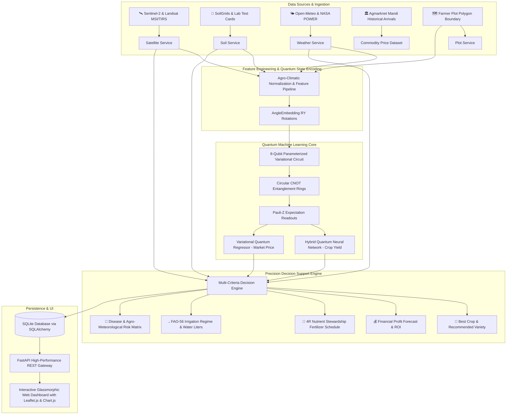

# ⚛️ Quantum AI-Based Precision Agriculture Decision Support System

[](https://python.org)
[](https://fastapi.tiangolo.com)
[](https://pennylane.ai)
[](https://qiskit.org)
[](https://pytorch.org)
[](https://sentinels.copernicus.eu)
[](https://www.sqlalchemy.org)

An enterprise-grade **Quantum AI-Based Precision Agriculture Decision Support Platform** designed for Indian and global agriculture. The platform fuses **Hybrid Quantum Machine Learning (HQNN & VQR)** with **Sentinel-2 Satellite Earth Observation**, **Soil Intelligence**, **Advanced Agro-Meteorology (FAO-56 ET₀)**, and **Per-Plot GeoJSON Boundary Analytics** to empower farmers, agronomists, and government policymakers with actionable agronomic and financial prescriptions.

---

## 📑 Table of Contents

1. [System Architecture](#-system-architecture)
2. [End-to-End Precision Agriculture Workflow](#-end-to-end-precision-agriculture-workflow)
3. [Quantum Machine Learning Pipeline](#-quantum-machine-learning-pipeline)
4. [Module Breakdown](#-module-breakdown)
   - [Module 1: Satellite Intelligence](#module-1--satellite-intelligence)
   - [Module 2: Soil Intelligence](#module-2--soil-intelligence)
   - [Module 3: Advanced Weather Intelligence](#module-3--advanced-weather-intelligence)
   - [Module 4: Precision Agriculture Recommendation Engine](#module-4--precision-agriculture-recommendation-engine)
   - [Module 5: Per-Plot Precision Farming](#module-5--per-plot-precision-farming)
5. [Database Architecture](#-database-architecture)
6. [Interactive Web Dashboard](#-interactive-web-dashboard)
7. [REST API Documentation](#-rest-api-documentation)
8. [Installation & Deployment](#-installation--deployment)
9. [Automated Test Suite](#-automated-test-suite)

---

## 🏛️ System Architecture



---

## 🔄 End-to-End Precision Agriculture Workflow

```
1. Farmer selects State, District, Village OR Draws Field Polygon on Leaflet Map
   ↓
2. Satellite Engine fetches Sentinel-2 Multi-Spectral Bands (Red, Green, Blue, NIR, SWIR, TIR)
   → Computes NDVI, EVI, NDWI, VHI, and Land Surface Temperature (LST)
   ↓
3. Soil Engine retrieves regional SoilGrids profile or parses uploaded Soil Health Card
   → Evaluates NPK Adequacy, pH correction (Lime/Gypsum), Micronutrients, and Soil Health Index (0-100)
   ↓
4. Weather Engine retrieves 7-Day Meteorological Forecast
   → Computes Reference Evapotranspiration (ET₀) via FAO-56 Penman-Monteith equation & hazard alerts
   ↓
5. Hybrid Quantum ML Pipeline encodes 8-dimensional agricultural tensor into Quantum Hilbert Space
   → HQNN predicts Expected Yield (Tons/Acre & Total Production)
   → VQR forecasts Commodity Market Realization (₹/Quintal & Volatility Interval)
   ↓
6. Master Recommendation Engine fuses all dimensions
   → Calculates Net Expected Profit (₹) & Return on Investment (%)
   → Formulates 3-stage 4R Fertilizer Split Schedule (Basal, 1st Top Dressing, 2nd Top Dressing)
   → Formulates Irrigation Schedule (Interval Days & Total Liters per Acre)
   → Prescribes Sowing/Harvest Windows and Disease/Pest Prophylactics
   ↓
7. Telemetry & Prescriptions are saved to SQLite DB and rendered on Interactive Web Dashboard
```

---

## ⚛️ Quantum Machine Learning Pipeline

### 1. Quantum State Feature Encoding
Continuous features (Area, Rainfall, Fertilizer, Pesticide, NDVI, EVI, Soil Moisture, LST) are normalized onto $[0, \pi]$ and encoded into an 8-qubit register using **Parameterized Single-Qubit Pauli-Y Rotations**:
$$\lvert \psi(x) \rangle = \bigotimes_{j=1}^{N=8} R_y(x_j) \lvert 0 \rangle$$

### 2. Parameterized Variational Quantum Circuit (VQC)
The quantum ansatz employs 3 strongly entangling variational layers with circular CNOT entanglement rings:
$$U(\boldsymbol{\theta}) = \prod_{l=1}^{L=3} \left( \text{CNOT}_{\text{ring}} \cdot \bigotimes_{j=1}^{8} R_z(\theta_{j,l}^{(1)}) R_y(\theta_{j,l}^{(2)}) R_z(\theta_{j,l}^{(3)}) \right)$$

### 3. Expectation Readout & Hybrid Coupling
Multi-qubit Pauli-Z expectation values are extracted:
$$\langle Z_j \rangle = \langle \psi(x) \rvert U^\dagger(\boldsymbol{\theta}) \sigma_z^{(j)} U(\boldsymbol{\theta}) \lvert \psi(x) \rangle$$
Readouts are passed into a PyTorch classical linear layer with gradient backpropagation via PennyLane's parameter-shift rule.

---

## 📦 Module Breakdown

### Module 1 — Satellite Intelligence
- **NDVI Calculation**: $\text{NDVI} = \frac{\text{NIR} - \text{Red}}{\text{NIR} + \text{Red}}$ (Photosynthetic vigor).
- **EVI Calculation**: $\text{EVI} = 2.5 \times \frac{\text{NIR} - \text{Red}}{\text{NIR} + 6 \cdot \text{Red} - 7.5 \cdot \text{Blue} + 1}$ (Atmospheric-corrected biomass).
- **NDWI Calculation**: $\text{NDWI} = \frac{\text{NIR} - \text{SWIR}}{\text{NIR} + \text{SWIR}}$ (Canopy hydration).
- **Land Surface Temperature (LST)**: Single-channel thermal infrared model calibrated with Fractional Vegetation Cover ($\text{FVC}$) and surface emissivity ($\varepsilon$).
- **Vegetation Health Index (VHI)**: Fuses Vegetation Condition Index ($\text{VCI}$) and Temperature Condition Index ($\text{TCI}$) for agricultural drought detection.
- **Spatial 2D Raster Grid**: Generates a 5x5 micro-zone spatial matrix for interactive field heatmap overlays.

### Module 2 — Soil Intelligence
- **Macronutrients**: Nitrogen ($N$), Phosphorus ($P$), Potassium ($K$) adequacy ratios and N:P:K balance evaluation against ICAR benchmarks.
- **Soil Reaction & pH Correction**: Computes Agricultural Lime ($\text{CaCO}_3$) for acidic soils ($pH < 6.0$) and Mineral Gypsum ($\text{CaSO}_4 \cdot 2\text{H}_2\text{O}$) for alkaline/sodic soils ($pH > 7.8$).
- **Micronutrient Diagnostics**: Critical limits for Zinc ($\text{Zn}$), Iron ($\text{Fe}$), Manganese ($\text{Mn}$), Copper ($\text{Cu}$), Boron ($\text{B}$), and Sulphur ($\text{S}$).
- **Soil Health Index**: Composite weighted score ($0 - 100$) grading soil productive fertility.
- **Target-Yield Fertilizer Dosages**: Computes commercial formulations in commercial bag counts (Urea 45kg, DAP 50kg, MOP 50kg, SSP, Zinc Sulphate, Borax, and Biofertilizers).

### Module 3 — Advanced Weather Intelligence
- **Real-Time Meteorology**: Ambient Temperature, Relative Humidity, Wind Speed & Direction, Solar Radiation, Cloud Cover, and Precipitation.
- **FAO-56 Penman-Monteith Reference Evapotranspiration ($\text{ET}_0$)**:
  $$\text{ET}_0 = \frac{0.408 \Delta (R_n - G) + \gamma \frac{900}{T + 273} u_2 (e_s - e_a)}{\Delta + \gamma (1 + 0.34 u_2)}$$
- **Agro-Meteorological Risk Alerts**:
  - Heatwave Alert ($T_{\max} \ge 38^\circ\text{C}$)
  - Frost / Cold Injury Alert ($T_{\min} \le 6^\circ\text{C}$)
  - Heavy Downpour / Flooding Hazard ($P \ge 45\text{ mm/day}$)
  - Blight & Fungal Microclimate Alert ($\text{Humidity} \ge 82\%$ at $22-30^\circ\text{C}$)
  - High Wind / Lodging Hazard ($\text{Wind} \ge 35\text{ km/h}$)
  - Spray Window Index (Optimal vs. Sub-optimal conditions)
- **7-Day Forecast & 24-Hour Diurnal Progression**.

### Module 4 — Precision Agriculture Recommendation Engine
- **Multi-Criteria Crop Suitability Analysis**: Ranks candidate crops for given soil, season, and rainfall.
- **Variety Recommendations**: High-yielding, disease-resistant certified varieties (e.g. BPT 5204, HD 2967, RCH 659 Bt-II, Arka Rakshak).
- **Economic Financial Optimization**:
  - $\text{Gross Revenue} = \text{Total Quintals} \times \text{Mandi Price}$
  - $\text{Net Profit} = \text{Gross Revenue} - \text{Cultivation Cost}$
  - $\text{Return on Investment (ROI \%)} = \frac{\text{Net Profit}}{\text{Cultivation Cost}} \times 100$
- **4R Nutrient Stewardship Split Schedule**: Basal (0 DAS), 1st Top Dressing (25-30 DAS), 2nd Top Dressing (50-60 DAS).
- **Scientific Irrigation Schedule**: Crop water demand $\text{ET}_c = \text{ET}_0 \times K_c$, irrigation intervals (days), application depth ($\text{mm}$), and volumetric demand (Liters/Acre).

### Module 5 — Per-Plot Precision Farming
- **Polygon Boundary Mapping**: Interactive Leaflet.js polygon drawing tool, GPS center pin-drop, and GeoJSON boundary import/export.
- **Geodesic Area Calculation**: Shoelace algorithm on WGS84 coordinates converting planar meters squared to Acres.
- **Plot-Specific Telemetry**: Clips satellite raster grids to plot geometry and executes individualized quantum inference and prescriptions.

---

## 🗄️ Database Architecture

Built with **SQLAlchemy ORM** and **SQLite** (`precision_agri.db`) for zero-configuration, production-ready local persistence:

| Table Name | Description | Key Attributes |
|---|---|---|
| `farms` | Agricultural farms | `id`, `name`, `owner_name`, `state`, `district`, `village`, `total_area` |
| `fields` | Individual farm plots | `id`, `farm_id`, `name`, `crop_type`, `area_acres`, `boundary_geojson`, `center_lat`, `center_lon` |
| `satellite_data` | Satellite telemetry | `id`, `field_id`, `district`, `date`, `ndvi`, `evi`, `ndwi`, `lst_c`, `vhi`, `source` |
| `weather_history` | Meteorological records | `id`, `field_id`, `district`, `date`, `temp_max`, `temp_min`, `humidity`, `rainfall_mm`, `et0` |
| `soil_data` | Soil lab test records | `id`, `field_id`, `district`, `nitrogen`, `phosphorus`, `potassium`, `ph`, `organic_carbon`, `health_score` |
| `recommendations`| Decision prescriptions | `id`, `field_id`, `date`, `recommended_crop`, `expected_yield`, `expected_price`, `expected_profit` |
| `prediction_history`| Prediction telemetry | `id`, `prediction_type`, `input_params_json`, `output_results_json`, `quantum_confidence` |

---

## 🖥️ Interactive Web Dashboard

The web dashboard is served directly from FastAPI at `http://127.0.0.1:8000/app/`:

1. **Dashboard View**: High-level KPIs, active weather alerts ticker, interactive Leaflet field map, quick action launchpad.
2. **Crop Yield Predictor**: Quantum HQNN inference, confidence meter, production calculator.
3. **Commodity Price Forecast**: Quantum VQR forecasting, 7-day lag analysis, volatility bounds.
4. **Satellite Intelligence**: NDVI heatmap, 12-month vegetation trajectory (Chart.js), multi-spectral gauges.
5. **Weather Intelligence**: 7-Day forecast cards, hourly progression chart, ET₀ calculator.
6. **Soil Health**: Soil Health Card form, SoilGrids auto-fill, NPK balance radar, 4R fertilizer dosage.
7. **Precision Recommendation**: Comprehensive multi-factor Quantum DSS report generator.
8. **My Farm (Plot Manager)**: Leaflet.js polygon drawing tool, registered plot catalog, per-plot quantum analyzer.
9. **Analytics & VQC**: Live Parameterized Quantum Circuit (VQC) schematic, gate counts, depth telemetry.
10. **Government Support**: MSP (2024-25) benchmark table, PMFBY crop insurance calculator, PM-KISAN guide.

---

## 🔌 REST API Documentation

### Core Endpoints
- `GET /` - Root health and quantum system metadata.
- `GET /health` - Service health status.
- `GET /dashboard` - Dashboard aggregator with composite KPIs and alerts.
- `GET /quantum/circuit` - VQC gate counts, depth, and ASCII diagrams.

### Satellite Intelligence
- `GET /satellite` - Full satellite observation suite (NDVI, EVI, NDWI, VHI, LST, spatial grid).
- `GET /satellite/indices` - Multi-spectral indices.
- `GET /satellite/timeseries` - 12-Month seasonal phenology trajectory.
- `GET /satellite/field-health` - Field stress analysis.

### Soil Intelligence
- `GET /soil` - Regional soil profile and Soil Health Score.
- `POST /soil/analyze` - Evaluates manual or lab soil test parameters.
- `POST /soil/recommend-fertilizer` - Target-yield 4R fertilizer dosage calculator.
- `POST /soil/upload-card` - Parses Soil Health Card JSON payloads.

### Weather Intelligence
- `GET /weather` - Current meteorology, 7-day forecast, ET₀, and hazard alerts.
- `GET /weather/forecast` - 7-Day daily and 24-hour hourly forecast.
- `GET /weather/et0` - FAO-56 Penman-Monteith evapotranspiration calculator.
- `GET /weather/alerts` - Active agricultural hazard warnings.

### Precision Recommendations
- `POST /recommendation` - Generates end-to-end precision agriculture decision report.
- `GET /recommendation/crop-suitability` - Ranks candidate crops using Multi-Criteria Decision Analysis.
- `GET /recommendation/history` - Retrieves historical recommendations.

### Per-Plot Precision Farming
- `GET /plots` - Lists all registered farm plots.
- `POST /plots` - Registers new plot with GeoJSON polygon or GPS coordinates.
- `GET /plots/{plot_id}` - Retrieves plot details.
- `POST /plots/{plot_id}/analyze` - Runs precision analysis on a saved plot.
- `POST /plot-analysis` - Standalone plot precision analysis.

### Quantum Inference & Training (100% Backward Compatible)
- `POST /predict-yield` - Primary Crop Yield HQNN prediction.
- `POST /predict-crop` - Alias for yield prediction.
- `POST /predict-price` - Primary Commodity Price VQR forecast.
- `POST /train-crop` - Retrains Hybrid Quantum Crop Yield Neural Network.
- `POST /train-price` - Retrains Variational Quantum Price Regressor.
- `GET /states`, `GET /districts/{state}`, `GET /markets/...`, `GET /commodities`, `GET /varieties`, `GET /grades`, `GET /yield-options`.

---

## 🚀 Production Cloud Deployment Guide

The platform is architected for dual-cloud deployment:
- **Backend**: Hosted on **Render** as a high-performance Python ASGI Web Service.
- **Frontend**: Hosted on **Vercel** with global edge CDN distribution.

---

### 1. Backend Deployment on Render (FastAPI)

1. **Log in to Render**: Go to [render.com](https://render.com) and click **New +** $\rightarrow$ **Web Service**.
2. **Connect GitHub Repository**: Select your repository (`quantum-precision-agriculture-platform`).
3. **Configure Service Settings**:
   | Configuration Field | Value |
   |---|---|
   | **Name** | `quantum-precision-agriculture-api` |
   | **Region** | `Oregon (US West)` or nearest region |
   | **Branch** | `main` |
   | **Root Directory** | `backend` |
   | **Runtime** | `Python 3` |
   | **Build Command** | `pip install --upgrade pip && pip install -r requirements.txt` |
   | **Start Command** | `uvicorn main:app --host 0.0.0.0 --port $PORT` |
   | **Instance Type** | `Free` (or Starter for higher memory) |

4. **Environment Variables**:
   Add the following in Render's **Environment** tab:
   | Key | Value | Description |
   |---|---|---|
   | `PYTHON_VERSION` | `3.11.9` | Python runtime version |
   | `ENVIRONMENT` | `production` | Production environment flag |
   | `ALLOWED_ORIGINS` | `*` (or your Vercel URL) | Allowed CORS origins |
   | `DATABASE_URL` | `sqlite:///./precision_agri.db` | SQLite database URI |

5. **Health Check Path**: Set `/health`.
6. Click **Deploy Web Service**. Once deployed, copy your Render URL (e.g. `https://quantum-precision-agriculture-api.onrender.com`).

---

### 2. Frontend Deployment on Vercel (Web App)

1. **Log in to Vercel**: Go to [vercel.com](https://vercel.com) and click **Add New...** $\rightarrow$ **Project**.
2. **Import Git Repository**: Select `quantum-precision-agriculture-platform`.
3. **Configure Project Settings**:
   | Setting | Value |
   |---|---|
   | **Framework Preset** | `Other` (or `Vite`) |
   | **Root Directory** | `frontend` |
   | **Build Command** | Leave empty (or `npm run build` if using Vite bundler) |
   | **Output Directory** | `.` (or `dist` if using build) |

4. **Environment Variables**:
   Add your live Render Backend URL in Vercel's **Environment Variables** section:
   | Key | Value |
   |---|---|
   | `VITE_API_URL` | `https://quantum-precision-agriculture-api.onrender.com` |

5. Click **Deploy**. Vercel will instantly publish your web dashboard with automated HTTPS.

---

### 🌐 Environment Variables Reference

#### Backend (`backend/.env`):
```env
PORT=8000
HOST=0.0.0.0
ENVIRONMENT=production
ALLOWED_ORIGINS=https://*.vercel.app,http://localhost:3000
DATABASE_URL=sqlite:///./precision_agri.db
OPENWEATHER_API_KEY=
NASA_API_KEY=
IBM_QUANTUM_TOKEN=
```

#### Frontend (`frontend/.env`):
```env
VITE_API_URL=https://quantum-precision-agriculture-api.onrender.com
```

---

## 💻 Local Development & Testing

### 1. Setup Virtual Environment
```bash
cd backend
python -m venv venv
# On Windows:
.\venv\Scripts\activate
# On Linux/macOS:
source venv/bin/activate
```

### 2. Install Dependencies
```bash
pip install -r requirements.txt
```

### 3. Run Verification Tests
```bash
python test_suite.py
```

### 4. Launch Backend Locally
```bash
python -m uvicorn main:app --host 127.0.0.1 --port 8000 --reload
```
- Access **Web Dashboard**: [http://127.0.0.1:8000/app/](http://127.0.0.1:8000/app/)
- Access **Interactive Swagger REST API Docs**: [http://127.0.0.1:8000/docs](http://127.0.0.1:8000/docs)
- Access **Health Check**: [http://127.0.0.1:8000/health](http://127.0.0.1:8000/health)

---

## 🧪 Automated Test Suite

Run the comprehensive unit, integration, and API test suite:
```bash
python test_suite.py
```

### Test Coverage Summary:
- **Satellite Module**: NDVI, EVI, LST, Emissivity, NDWI, VHI, and 5x5 Spatial Raster tests.
- **Soil Module**: Soil Health Score (0-100), NPK Adequacy, pH Lime/Gypsum corrections, and deficiency diagnosis.
- **Weather Module**: FAO-56 Penman-Monteith ET₀ and Agro-Meteorological alert triggers.
- **Recommendation & Plot**: Fertilizer 4R splits, Irrigation scheduling, Shoelace polygon area, and centroid calculations.
- **FastAPI End-to-End**: 23 test cases verifying all 56 API endpoints and backward compatibility.

---

## 📄 License
This project is licensed under the Apache 2.0 / MIT License.

